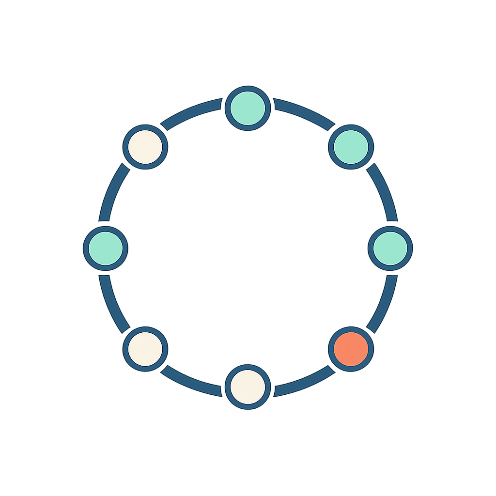

<p align="center">
  
</p>

<h1 align="center">Mineralink</h1>

Mineralink visualizes a "mineral wheel": a circular diagram showing how essential minerals and vitamins interact with each other, enhanced with AI-powered insights.

A **mineral wheel** is a visual tool used in nutrition science and functional medicine to illustrate the complex interactions between essential minerals (and often vitamins) in the human body. It is typically presented as a circular diagram where:

- **Each node** on the wheel represents a mineral (like calcium, magnesium, zinc, etc.) or sometimes a vitamin:
  - **Synergistic** (helpful/cooperative): Nutrients that enhance each other's absorption or function. For example, Vitamin D helps the body absorb calcium.
  - **Antagonistic** (inhibitory/competitive): Nutrients that can interfere with each other's absorption or function. For example, excess calcium can inhibit the absorption of magnesium or iron.

The wheel helps quickly see which nutrients work together and which may compete, making it easier to understand how dietary choices or supplements might affect overall mineral balance.

This concept is inspired by educational tools used in nutrition and functional medicine to help understand the complex interplay between micronutrients.

**Data Source:**
- The information in Mineralink is a simplified model for educational and visualization purposes, not a substitute for professional dietary advice.

## Features
- **Mineral Interaction Wheel:** Visualize minerals and vitamins as nodes on a circular wheel.
- **Synergistic & Antagonistic Relationships:** Click any mineral/vitamin to see which others enhance (synergistic) or inhibit (antagonistic) its function.
- **Color-coded Interactions:** Selected minerals are highlighted; antagonistic relationships are shown in red, while synergistic ones are shown in green.
- **AI-Powered Insights:** Get deficiency symptoms and food source recommendations using Google's Gemini AI.

## Getting Started

Visit https://mineralink-nine.vercel.app/

or build it yourself.

### Prerequisites
- [Node.js](https://nodejs.org/) 
- [pnpm](https://pnpm.io/) (or use npm/yarn)
- [Google Gemini API Key](https://makersuite.google.com/app/apikey) (for AI features)

### Installation

1. Clone the repository:
   ```bash
   git clone <your-repo-url>
   cd Mineralink
   ```
2. Install dependencies:
   ```bash
   pnpm install
   # or
   npm install
   # or
   yarn install
   ```

### Environment Setup

1. If you want AI insights enabled, create a `.env` file in the project root:
   ```bash
   VITE_GEMINI_API_KEY=your-gemini-api-key-here
   ```

2. Get your API key from [Google AI Studio](https://makersuite.google.com/app/apikey)

### Running the App

Start the development server:
```bash
pnpm dev
# or
npm run dev
# or
yarn dev
```

Open [http://localhost:5173](http://localhost:5173) in your browser to view the app.

## Deployment

Make sure to:
- Set the `VITE_GEMINI_API_KEY` environment variable
- Configure build settings for Vite/React

## Customization
Add or edit minerals/vitamins and their relationships in the data source in `src/domain/mineral-data.ts`, following the given model format.

## License
MIT
